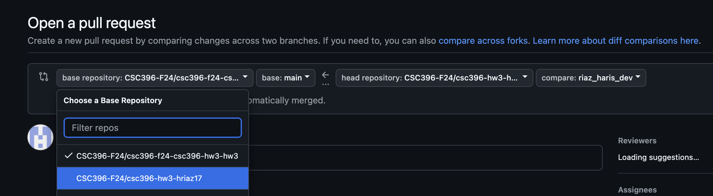
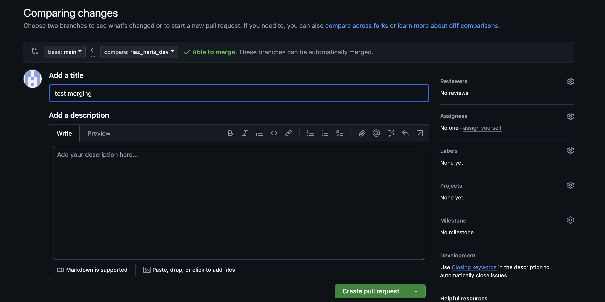
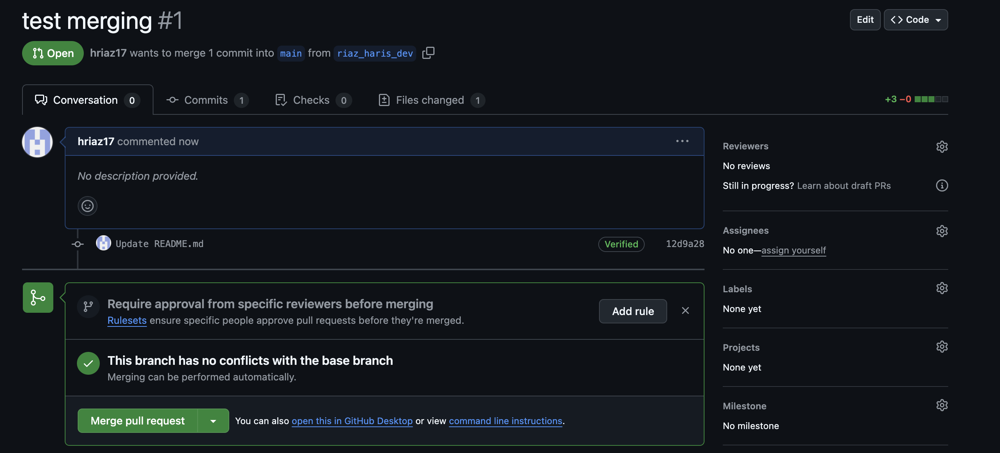

# CSC396-HW3
# Working with Jupyter Notebooks in Git

This guide will help you set up your environment and learn how to commit and push Jupyter notebooks using Git and GitHub.

## Setup your environment

You will need to set up an appropriate coding environment on your computer. Minimally, you will need:

* [git](https://git-scm.com/downloads/)
* [Python (3.8 or higher)](https://www.python.org/)
* [Jupyter Notebook](https://jupyter.org/install)

## Check out a new branch

Before you start working on your Jupyter notebooks, create a new branch in your GitHub repository:

1. Go to the repository/fork created for you by GitHub Classroom. It should look like `https://github.com/CSC396-F24/csc396-hw3-<your-username>`.
2. Create a [branch](https://help.github.com/articles/creating-and-deleting-branches-within-your-repository/) through the GitHub interface.
3. Name your branch as `lastname_firstname_dev` (**important: do not name it anything else**).
4. Clone the repository and checkout your new branch:
   ```
   git clone -b lastname_firstname_dev git@github.com:CSC396-F24/csc396-hw3-<your-username>.git
   ```

## Working with Jupyter Notebooks

1. Navigate to your cloned repository folder.
2. Launch Jupyter Notebook:
   ```
   jupyter notebook
   ```
3. Create or open the assigned Jupyter notebook(s).
4. Complete your work in the notebook(s), making sure to save your changes frequently.

## Committing and Pushing Jupyter Notebooks

Jupyter notebooks are JSON files with a `.ipynb` extension. Here's how to commit and push them:

1. Save your notebook in Jupyter.
2. Open a terminal/command prompt and navigate to your repository folder.
3. Stage your changes:
   ```
   git add YourNotebook.ipynb
   ```
4. Commit your changes:
   ```
   git commit -m "Descriptive message about your changes"
   ```
5. Push your changes to GitHub:
   ```
   git push origin lastname_firstname_dev
   ```

## Important Notes

- Jupyter notebooks contain output cells that can make diffs hard to read. Consider using [nbdime](https://nbdime.readthedocs.io/) for better notebook diffing and merging.
- Don't forget to save your notebook before committing!

## Submitting your work

When you've completed your work, you can submit the assignment by merging the `lastname_firstname_dev` into the main branch of your fork. You can do this either via the command line or the Github web interface.

#### Command line: 

1. Ensure you're on the `lastname_firstname_dev` branch:
   ```
   git checkout lastname_firstname_dev
   ```
2. Make sure your `lastname_firstname_dev` branch is up-to-date:
   ```
   git pull origin lastname_firstname_dev
   ```
3. Switch to the `main` branch:
   ```
   git checkout main
   ```
4. Merge the `lastname_firstname_dev` branch into `main`:
   ```
   git merge lastname_firstname_dev
   ```
5. Push the merged changes to your fork:
   ```
   git push origin main
   ```

#### Web Interface:
1. Once you push a commit to your dev branch, you will see the option to "Compare & pull request". Click that option:


2. This will take you to the "Comparing changes" screen. Once there, make sure to select the **second** option from the dropdown menu that corresponds to your repository and not the assignment base repository: 


3. Click the "Create pull request" button 


4. Click the "Merge pull request" button



Your instructor will review and grade the work from your last merge. Make sure to merge before the assignment deadline! Any commits merged after the deadline will not be considered for grading.

## Grading

Your submission will be graded based on correctly implementing the solutions to each problem described in the handout.

